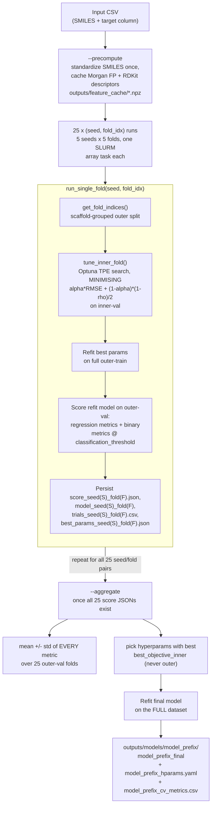
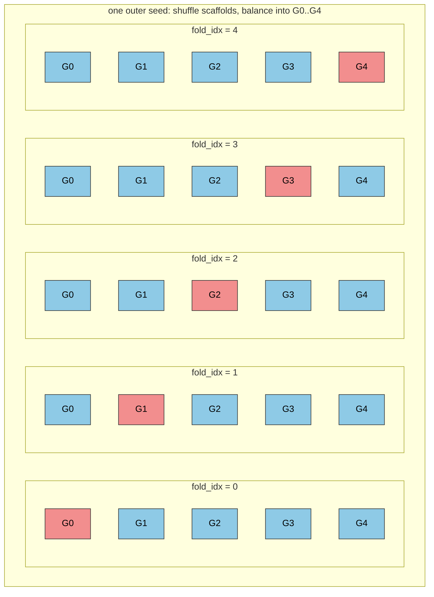
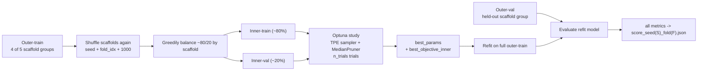

# Contributing Guidelines

## Project Architecture & Configuration

* **Configuration File Placement:** Store YAML configuration files in a top-level `config/` directory rather than within the source codebase.
* **Immutable Source Code:** Applications must accept configuration paths as input arguments. Users should never be required to modify source files (which may reside in virtual environments) to change configurations.
* **Model Weights and Checkpoint File Placement:** Store checkpoint files in a top-level dedicated directory rather than within the source codebase. The directory shall be ignored by Git.
* **Dependency Management:** Keep the `.toml` file updated when introducing new packages. Categorize dependencies appropriately (e.g., separating core inference requirements from development and testing tools) to allow for environment-specific installations.
* **Cache Management:** Output cache files to a dedicated, user-configurable directory. Avoid generating cache files in the same directories as input data (e.g., CSV folders) to prevent clutter.
* **Hardware Agnosticism:** Do not hardcode hardware-specific parameters (such as CUDA device IDs in XGBoost or similar libraries). These must always be exposed as user-configurable arguments.

## Code Quality & Formatting

* **Type Hinting:** Define explicit type signatures for all function arguments and return types.
* **Linting:** Utilize `pylint` continuously to enforce quality standards and maintain a high code quality score.
* **Standard Formatting:** Adhere to standard spacing rules (e.g., PEP 8 for Python). Avoid custom or non-standard visual alignments, such as aligning `=` assignment operators across consecutive lines.

## Function Design & State Management

* **Variable Scope:** Minimize the use of global variables, including global configuration objects. Pass necessary state and parameters directly via function arguments.
* **Sensible Defaults:** Provide default values for function arguments where appropriate to streamline API usage and allow for concise function calls.

## Documentation & Reproducibility

* **Reproducibility:** Design all code and workflows to be fully reproducible. Maintain comprehensive guidelines and tutorials to assist users in replicating results.
* **Inline Documentation:** Supplement standard function docstrings with fine-grained, inline comments. Provide explanatory context for substantial logical blocks or complex operations within the code.

## Development

## Environment Setup

On Berzelius, to create the environment:

``bash
module load Mambaforge/23.3.1-1-hpc1-bdist
mamba create -n env-retrotac python=3.12 -y
mamba activate env-retrotac
pip install uv
```

Export the `uv` to a proper location and activate the environment:

```bash
export UV_CACHE_DIR="/proj/berzelius-2026-62/users/x_steri/.cache"
mamba activate env-retrotac
uv sync --extra training # For Stefano and Andrea, training stuff
uv sync --all-extras # For Lukas, training only
```

If `uv sync`/`mamba create` blow your `$HOME` file-count quota (each env is tens of
thousands of small files), use the prebuilt Apptainer containers instead —
see `apptainer/README.md`. There's one per profile above (`inference`,
`training`, `scoring`), each a single `.sif` file regardless of how many
packages it holds.

### Training

Example:

```bash
uv run python scripts/models/train.py \
  --model xgb \
  --input data/llm_scoring/routes_llm_scores.csv \
  --config config/models_config.yaml \
  --output-root outputs/ \
  --prefix PREFIX \
  --n_trials 5 \
  --seed 42 \
  --fold 1
```

To specify the SMILES and label columns, update the config file. GNN pretrained files can be obtained via:

```bash
wget https://zenodo.org/records/15460715/files/chemeleon_mp.pt
```

To test SLURM jobs on Berzelius:

```bash
srun --account=Berzelius-2026-62 --partition=berzelius --gpus=1 --cpus-per-task=16  python scripts/models/train.py   --model xgb   --input data/llm_scoring/routes_llm_scores.csv   --config config/models_config.yaml   --output-root outputs/   --prefix PREFIX   --n_trials 2   --seed 42   --fold 1 --device gpu

srun --account=Berzelius-2026-62 --partition=berzelius --gpus=1 --cpus-per-task=16  python scripts/models/train.py   --model mlp   --input data/llm_scoring/routes_llm_scores.csv   --config config/models_config.yaml   --output-root outputs/   --prefix PREFIX   --n_trials 2   --seed 42   --fold 1 --device gpu

srun --account=Berzelius-2026-62 --partition=berzelius --gpus=1 --cpus-per-task=16  python scripts/models/train.py   --model gnn   --input data/llm_scoring/routes_llm_scores.csv   --config config/models_config.yaml   --output-root outputs/   --prefix PREFIX   --n_trials 2   --seed 42   --fold 2 --device gpu
```

Change the PREFIX to anything useful to keep track of the runs.

To run a job array on SLURM, run:

```bash
sbatch slurm/train_cv_array_xgb.sh
sbatch slurm/train_cv_array_mlp.sh
sbatch slurm/train_cv_array_gnn.sh
```

Logs will saved under: `logs/models/<xgb|gnn|mlp>/`

### Cross-validation scheme

Training uses **5×5 nested, scaffold-grouped cross-validation**: 5 outer seeds
(`cross_validation.seeds` in `config/models_config.yaml`) × 5 outer folds
(`cross_validation.n_folds`) = 25 independent `(seed, fold_idx)` fits. Each pair is
one CLI invocation of `scripts/models/train.py` (see "Training" above), typically
one SLURM array task (`slurm/train_cv_array_*.sh`). Grouping by Bemis–Murcko
scaffold guarantees no scaffold spans a train/val boundary, at either nesting level.

#### Pipeline



#### Fold schematic — outer rotation

For one outer seed, scaffolds are shuffled with a seeded RNG then greedily
balanced into 5 groups `G0..G4`; each `fold_idx` in turn holds out a different
group as outer-val. All 5 seeds repeat this with an independent shuffle, giving
25 total outer-val evaluations.



#### Fold schematic — inner split (per outer fold)

The outer-train from the rotation above (4 of the 5 groups) is shuffled *again*
with an independent seed (`seed + fold_idx + 1000`) and split ~80/20 by scaffold
into inner-train/inner-val, used only by Optuna. The held-out outer-val group is
never touched during tuning — it only re-enters at the final scoring step.



Once all 25 `score_seed{S}_fold{F}.json` files exist, `--aggregate`:

1. reports mean ± std across the 25 outer-val folds for **every** metric the
   folds recorded (NaN-aware, so a fold with single-class labels only drops out
   of ROC-AUC/PR-AUC);
2. picks the hyperparameters with the best **inner** objective (never outer —
   avoids leakage from picking on a test-like split);
3. refits one final model on the **full** dataset with those hyperparameters;
4. saves the final model plus a `_hparams.yaml` CV summary and a
   `_cv_metrics.csv` of the raw per-fold rows under
   `outputs/models/<model>_<prefix>/`.

##### Metrics reported per fold

Each fold's `score_*.json` is flat and holds (see `retrotac/models/metrics.py`):

* **regression** — `r2`, `rmse`, `mae`, `medae`, `max_error`,
  `explained_variance`, `bias` (mean signed error), `pearson_r`,
  `spearman_rho`, `kendall_tau`;
* **binary, at `hpo.classification_threshold`** (default 0.7) — labels come from
  `y_true >= threshold` and the label-based metrics from `y_pred >= threshold`,
  while `clf_roc_auc` / `clf_pr_auc` rank on the *continuous* prediction:
  `clf_roc_auc`, `clf_pr_auc`, `clf_mcc`, `clf_f1`, `clf_precision`,
  `clf_recall`, `clf_specificity`, `clf_balanced_accuracy`, `clf_accuracy`,
  `clf_cohen_kappa`, `clf_pos_rate` (PR-AUC's no-skill baseline),
  `clf_pred_pos_rate` and the `clf_tp/fp/tn/fn` counts;
* the fold's composite `objective` and the `objective_alpha` / `clf_threshold`
  it was computed with.

##### Inner-loop objective

`tune_inner_fold` **minimises**

```
objective = objective_alpha * RMSE + (1 - objective_alpha) * (1 - spearman_rho) / 2
```

on the inner-val split (`hpo.objective_alpha` in `config/models_config.yaml`),
so a model is rewarded for getting the *ordering* right as well as the
magnitude. A collapsed model (constant predictions ⇒ undefined ρ) is scored as
ρ = −1, the maximum rank penalty. `objective_alpha` must stay a run-level
constant: Optuna trial values are only comparable under a fixed objective, so
tuning α *inside* the study would just drive it to whichever end flatters each
trial. The two components are stored as trial user attributes, so
`trials_*.csv` shows the accuracy/ranking trade-off per trial.

Note the study direction changed from `maximize` (inner-val R²) to `minimize`
with this objective. Optuna's `load_if_exists` does not check direction, so
`tune_inner_fold` verifies it explicitly and refuses a study DB left by an
older run rather than mixing incomparable trial values — delete the stale
`*_seed*_fold*.db` (and matching JSONs) and re-run those folds.

#### Output layout

Example for `--model xgb --prefix v1 --output-root outputs` (`outputs/` is
gitignored). File extensions on `model_seed*_fold*` / `<run_id>_final` depend on
the backend: xgb saves `.skops` + `.ubj`, mlp saves `.skops` + `.pt`, gnn saves a
single `.ckpt`. Per-fold models are omitted entirely with `--no-save-fold-models`.

**After one fold** (`--seed 42 --fold 0`, feature cache from a prior `--precompute`):

```
outputs/
├── feature_cache/                          # model-agnostic, built once via --precompute
│   ├── fp_r3_512.npz                       # cached Morgan fingerprints (named by fp_radius/fp_size)
│   └── desc.npz                            # cached RDKit descriptors
├── cv/
│   └── xgb_v1/                             # run_id = <model>_<prefix>
│       ├── xgb_v1_seed42_fold0.db          # Optuna SQLite study (resumable snapshot)
│       ├── trials_seed42_fold0.csv         # Optuna trials dataframe
│       ├── best_params_seed42_fold0.json   # best inner-val hyperparameters + best_objective_inner
│       ├── model_seed42_fold0.skops        # refit fold model - sklearn wrapper
│       ├── model_seed42_fold0.ubj          # refit fold model - XGBoost native (xgb only)
│       └── score_seed42_fold0.json         # {"seed": 42, "fold_idx": 0, "r2": ..., + every other metric}
└── models/                                 # empty until --aggregate
```

**After all 25 folds + `--aggregate`:**

```
outputs/
├── feature_cache/
│   ├── fp_r3_512.npz
│   └── desc.npz
├── cv/
│   └── xgb_v1/
│       ├── xgb_v1_seed{0..4}_fold{0..4}.db          # 25 Optuna studies
│       ├── trials_seed{0..4}_fold{0..4}.csv         # 25 trials dataframes
│       ├── best_params_seed{0..4}_fold{0..4}.json   # 25 best-param files
│       ├── model_seed{0..4}_fold{0..4}.{skops,ubj}  # 25 refit fold models
│       └── score_seed{0..4}_fold{0..4}.json         # 25 outer-val metric sets
└── models/
    └── xgb_v1/
        ├── xgb_v1_final.skops    # final model, refit on the FULL dataset
        ├── xgb_v1_final.ubj      # (xgb only; mlp: .skops+.pt, gnn: single .ckpt)
        ├── xgb_v1_hparams.yaml   # chosen hyperparams + cv_mean_r2/cv_std_r2/best_inner_objective/n_folds + cv_metrics
        └── xgb_v1_cv_metrics.csv # raw per-fold metric rows (one row per seed/fold)
```

## Tree route scoring 
Tree routes' scores can be computed as follows:
```bash
python retro_scores/route_scores/route_tree_score.py \\
      --input data/raw/routes.csv \\
      --config config/route_scoring.yaml \\
      --output data/outputs/routes_scored.csv \\
      --sep '\\t'
```
It takes SMILES, resolved and route as input columns. The output file contains the original columns with the scoring metrics, weighted synthesizability score and scoring notes. 
The input columns and scoring weights can be modified in `config/route_scoring.yaml`.
