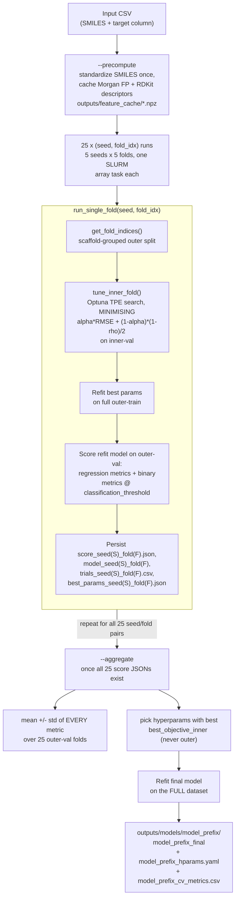
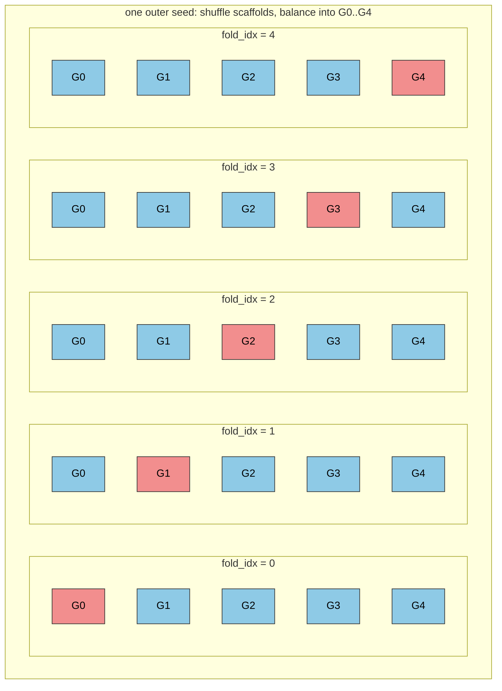
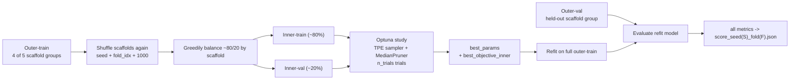

# Reproducibility Guide

This guide covers reproducing the results reported in the RetroTAC paper, for readers rerunning the pipeline and reviewers verifying it.

## Running the Commands

Every command below is written against an Apptainer container, so nothing needs installing beyond the images:

```bash
apptainer exec $(bash apptainer/bind_live_repo.sh) apptainer/<image>.sif <command>
```

`bind_live_repo.sh` mounts the live checkout over the image's baked-in copy, so local edits take effect without a rebuild. To run a step plainly instead, create the matching uv environment once, activate it, and drop the whole `apptainer exec ... .sif` prefix — the `<command>` itself is identical either way:

| Image | Equivalent environment |
|---|---|
| `inference.sif` | `uv sync` |
| `training.sif` | `uv sync --extra training` |
| `scoring.sif` | `uv sync --extra scoring` |

Each image also bakes in the `notebooks` extra for Jupyter, which none of the steps below need. Set the environment up once, and the deduplication step becomes:

```bash
uv sync --extra training && source .venv/bin/activate
python scripts/dataset/dedupe_routes.py --output data/routes/routes_scored_deduped.csv data/routes/routes_scored.csv
```

Two steps have no plain equivalent. The per-molecule scoring under [Get Synthesizability Scores](#get-synthesizability-scores) is invoked with `apptainer run` rather than `exec`, which routes to a *second* environment inside the same image — Python 3.10 with TensorFlow 2.8, torch 2.0, and dgl 2.1, as the SA/SC/RA/SYBA/GASA/FS scorers require. Running it outside the container means building that stack by hand, following [retro_scores/README.md](../retro_scores/README.md). Separately, `apptainer/deeppsa.sif` wraps the third-party DeepPSA model and has no uv profile at all.

Either way, the GPU steps still need a SLURM allocation, plus `--nv` when containerized: XGBoost's `.fit()` fails on the login node, whose GPU is in `compute_mode=Prohibited`.

## Artifacts

The archives under [release/](../release/) carry every input, intermediate, metric, and final model that the steps below produce, so any one stage can be verified without rerunning the stages before it.

| Archive | Size | Unpacks to | Contents |
|---|---|---|---|
| `retrotac_results.tar.gz` | 11.7 MiB | 31 MiB, 457 files | `outputs/` — per-fold metrics, best hyperparameters, Optuna trial tables and studies, ensemble results, scaffold analysis, appendix tables, paper figures |
| `retrotac_data.tar.gz` | 18.8 MiB | 169 MiB, 25 files | `data/` — routes, PROTAC-Splitter splits, every scored and deduplicated CSV, the development and held-out splits, DeepPSA comparison inputs, negative-data buckets |
| `retrotac_checkpoints.tar.gz` | 3.4 MiB | 9 MiB, 4 files | `outputs/models/` — the final XGBoost and MLP refits |
| `gnn_20260828_182305_final.ckpt.gz` | 90.7 MiB | 105.8 MiB | The final GNN refit |

Verify the checksums and unpack from the repository root, restoring the `data/` and `outputs/` trees in place:

```bash
(cd release && sha256sum -c <(grep '^[0-9a-f]\{64\}' MANIFEST.txt))

for f in release/*.tar.gz; do tar xzf "$f"; done

gunzip -kc release/gnn_20260828_182305_final.ckpt.gz \
    > outputs/models/gnn_20260828_182305/gnn_20260828_182305_final.ckpt
```

Each tarball restores its members at their original `data/` and `outputs/` paths, so every command below finds its inputs unchanged. `release/MANIFEST.txt` lists each member with its size, alongside the SHA-256 of each archive.

What's left out, to keep the download proportionate to what the guide needs:

- The 2.9 GB of per-fold model weights under `outputs/cv/`. Only their metrics ship, and those are all the evaluation and ranking steps read.
- `outputs/feature_cache_routes`, rebuilt by the `--precompute` step under [Training](#training).
- The enumerated screening library and its full prediction dump. The per-bucket slices that the negative-data analysis actually reads are included.

Rebuild the archives after regenerating any artifact, rewriting all four plus `MANIFEST.txt` under `release/`:

```bash
python scripts/release/make_artifacts.py            # writes release/ and MANIFEST.txt
python scripts/release/make_artifacts.py --dry-run  # resolve and size members, write nothing
```

The output is deterministic: rebuilding from unchanged inputs produces byte-identical archives, so re-running the script adds no new blobs to the repository.

## Reproducing

### Create Containers

See [apptainer/README.md](../apptainer/README.md) for instructions on building the containers.

### Get Synthesizability Scores

Score every molecule with the six per-molecule metrics (SA, SC, RA, SYBA, GASA, FS), raw and scaled. Produces `data/retro_scoring/routes_mol_scored.csv`.

```bash
apptainer run --nv --writable-tmpfs $(bash apptainer/bind_live_repo.sh) apptainer/scoring.sif \
        data/routes/routes.csv \
        data/retro_scoring/routes_mol_scored.csv \
        --smiles-col molecule
```

Score each retrosynthesis route on depth and fragment balance — the composite target the surrogate learns. Produces `data/routes/routes_scored.csv`, adding the `synthesizability` label and the `struct_*` terms behind it.

```bash
apptainer exec $(bash apptainer/bind_live_repo.sh) apptainer/scoring.sif \
    python retro_scores/route_scores/route_tree_score.py \
        --input data/routes/routes.csv \
        --output data/routes/routes_scored.csv \
        --config config/route_scoring.yaml \
        --route-col route \
        --resolved-col resolved \
        --smiles-col molecule
```

### Remove Duplicates

Collapse repeated SMILES down to their highest-scoring route, over the scored routes and both splits. Each call writes a `*_deduped.csv` beside its input.

```bash
apptainer exec $(bash apptainer/bind_live_repo.sh) apptainer/training.sif \
  python scripts/dataset/dedupe_routes.py \
    --output data/routes/routes_scored_deduped.csv \
    data/routes/routes_scored.csv

apptainer exec $(bash apptainer/bind_live_repo.sh) apptainer/training.sif \
  python scripts/dataset/dedupe_routes.py \
    --output data/sets/routes_train_val_deduped.csv \
    data/sets/routes_train_val.csv

apptainer exec $(bash apptainer/bind_live_repo.sh) apptainer/training.sif \
  python scripts/dataset/dedupe_routes.py \
    --output data/sets/routes_test_deduped.csv \
    data/sets/routes_test.csv
```

### Add Component Splits

Attach each PROTAC's warhead, linker, and E3 components from the PROTAC-Splitter output, producing `data/routes/routes_scored_with_components.csv`. Those component columns are what the $\eta^2$ leakage analysis below groups on.

```bash
apptainer exec $(bash apptainer/bind_live_repo.sh) apptainer/scoring.sif \
  python scripts/dataset/add_component_splits.py data/routes/routes_scored_deduped.csv \
  data/tack/tack_smiles_split.csv \
  --output data/routes/routes_scored_with_components.csv
```

### Isolate Held-Out Set

Cluster the dataset by Butina similarity and split off a held-out test set at the adaptive cutoff. Writes `routes_train_val.csv`, `routes_test.csv`, `adaptive_cluster_metrics.csv`, and a split report into `data/sets/`, alongside example-molecule figures.

```bash
apptainer exec $(bash apptainer/bind_live_repo.sh) apptainer/scoring.sif \
  python scripts/dataset/isolate_heldout.py data/routes/routes_scored_with_components.csv \
  --method adaptive \
  --output-dir data/sets/ \
  --make-figures --n-figure-mols 20
```

### Check Scaffold Leakage

If we use a standard random split or a whole-molecule scaffold split (which often degenerates into random splits for large PROTACs), identical warhead scaffolds will appear in both the training and test sets. The model will not learn the underlying physical or topological rules of synthesizability; it will simply memorize a lookup table (e.g., "If I detect this warhead scaffold, predict 3.8").

By calculating $\eta^2$ for the warhead, linker, and E3 separately, we identify which sub-space is leaking the most label information. We must then use that highest-$\eta^2$ sub-component to define our cross-validation folds, forcing the model to demonstrate true zero-shot generalization (scaffold hopping) on that specific substructure rather than exploiting statistical correlations in the training data.

- If $\eta^2 = 0$: The group means are identical to the grand mean. Knowing the scaffold tells us absolutely nothing about the synthesizability score. The variance is driven entirely by something else (e.g., functional group decorations that were stripped away by the scaffold generation).
- If $\eta^2 = 1$: The variance within any given group is zero. Every single PROTAC that shares a specific warhead scaffold has the exact same synthesizability score. The scaffold deterministically drives the label.

We use $\eta^2$ because it is the mathematically correct metric for quantifying the association between an unordered categorical independent variable (a scaffold string like "c1ccccc1") and a continuous dependent variable (a numerical synthesizability score).

Compute $\eta^2$ for each component key and each combination of keys, against all three targets. Writes one row per (target, key) pair into `outputs/scaffold_analysis/`.

```bash
apptainer exec $(bash apptainer/bind_live_repo.sh) apptainer/scoring.sif \
  python scripts/dataset/scaffold_analysis.py \
  data/sets/routes_train_val.csv \
  --combos all --combo-keys warhead linker e3 --combo-mode both \
  --targets synthesizability sa_score struct_n_steps \
  --output-dir outputs/scaffold_analysis
```

Combinations are now measured rather than assumed, and neither helps — product keys leak more, union keys percolate. Warhead grouping remains the best feasible point: 0% warhead leakage, 3,341 groups, largest 2.5% of data, and it closes the highest-η² channel (0.58–0.86). The residual 78% linker / 92% E3 leakage is not fixable on this dataset without discarding most of it, so we report it as a stated limitation.

The combination warhead&e3's near-zero $\eta^2$ is itself informative: it says that once we remove warhead and E3 identity, almost none of the label variance survives. That is a strong statement about what our targets are actually measuring.

### Training

See below for a visualization of the training pipeline.

The GNN backend needs the pretrained Chemeleon weights, downloaded once into `data/external/`
(gitignored) and pointed to by `gnn.chemeleon_weights` in `config/models_config_routes.yaml`:

```bash
wget -P data/external https://zenodo.org/records/15460715/files/chemeleon_mp.pt
```

Precompute the feature cache for all models (XGB, MLP) before training — a one-time step that runs on a login node (no GPU needed) and stores the cache in `outputs/feature_cache_routes`.

```bash
# 0. one-time feature cache (login node is fine — no GPU needed)
.venv/bin/python scripts/models/train.py --model xgb \
    --input data/sets/routes_train_val.csv \
    --config config/models_config_routes.yaml \
    --cache-dir outputs/feature_cache_routes --precompute
```

Launch the 5×5 nested CV as SLURM job arrays, one task per (seed, fold), then aggregate each backend's 25 folds. Folds write metrics, best parameters, trial tables, and models into `outputs/cv/`; aggregation writes the final refit plus `*_cv_metrics.csv` and `*_hparams.yaml` into `outputs/models/`.

```bash
# 1. all 25 (seed, fold) pairs per model — array idx/5 -> seed, idx%5 -> fold
sbatch slurm/train_cv_array_xgb.sh          # 5 seeds x 5 folds, 30 trials each
sbatch slurm/train_cv_array_mlp.sh          # 25 trials
sbatch slurm/train_cv_array_gnn.sh          # 15 trials

# 2. after all 25 folds of a model land
MODEL=xgb sbatch slurm/aggregate.sh
MODEL=mlp sbatch slurm/aggregate.sh
MODEL=gnn sbatch slurm/aggregate.sh
```

Or train directly inside a container rather than through SLURM, stamping the run with a timestamped `--prefix`. Writes the same per-fold artifacts under `outputs/cv/`.

```bash
apptainer exec $(bash apptainer/bind_live_repo.sh) apptainer/scoring.sif \
  python scripts/models/train.py \
  data/sets/routes_train_val.csv \
  --config configs/models_config_.yaml \
  --scaffold-col wh_smiles \
  --prefix `date +%Y%m%d_%H%M%S` \
  --device cuda \
  --molecule-col smiles \
  --target synthesizability \
```

Each fold's val predictions are scored with:

- regression: r2, rmse, mae, medae, max_error, explained_variance, bias, pearson_r, spearman_rho, kendall_tau
- binary @ 0.7: roc_auc, pr_auc, mcc, f1, precision, recall, specificity, balanced_accuracy, accuracy, cohen_kappa, pos_rate (the PR-AUC no-skill baseline), pred_pos_rate, tp/fp/tn/fn

### Evaluation

Rank the three backends against each other on their paired CV folds, using AutoRank. Writes the ranking table, paired fold scores, and metric summaries into `outputs/results/results_20260828_182305/`.

```bash
apptainer exec $(bash apptainer/bind_live_repo.sh) apptainer/training.sif \
  python scripts/models/evaluation.py \
    --models xgb_20260828_182305 mlp_20260828_182305 gnn_20260828_182305 \
    --config config/models_config_routes.yaml \
    --output-root outputs \
    --out results_20260828_182305
```

The same comparison, extended to score each backend's final refit on the held-out set. Adds `test_metrics.csv` and `test_predictions.pkl` to that results directory.

```bash
sbatch slurm/evaluate.sh

# OR:

srun -A berzelius-2026-62 -p berzelius --gpus=1 --time=00:30:00 --pty \
  apptainer exec --nv $(bash apptainer/bind_live_repo.sh) apptainer/training.sif \
  python scripts/models/evaluation.py \
    --models xgb_20260828_182305 mlp_20260828_182305 gnn_20260828_182305 \
    --config config/models_config_routes.yaml \
    --output-root outputs \
    --out results_20260828_182305 \
    --test-csv data/sets/routes_test.csv
```

#### Ensembles

Score the four ensemble strategies — best single, uniform, best backend, and Caruana selection — by predicting the test set with all 75 fold models. Writes `ensemble_strategies.csv`, a weight JSON per strategy, and the cached `cv_fold_test_predictions.pkl` that makes reruns cheap.

```bash
ENSEMBLE=1 sbatch slurm/evaluate.sh

# OR:

apptainer exec --nv $(bash apptainer/bind_live_repo.sh) apptainer/training.sif \
    python scripts/models/evaluation.py \
    --models xgb_20260828_182305 mlp_20260828_182305 gnn_20260828_182305 \
    --config config/models_config_routes.yaml \
    --output-root outputs \
    --out results_20260828_182305 \
    --test-csv data/sets/routes_test.csv \
    --ensemble

# Rerunning cheaply once fold predictions are cached (e.g. to retune Caruana
# without reloading 75 models):
ENSEMBLE=1 ENSEMBLE_ITERATIONS=200 sbatch slurm/evaluate.sh   # skips load/predict, reuses cv_fold_test_predictions.pkl
```

#### Compare Evidential vs. Ensembles

Rerun the ensemble scoring beside an evidential GNN's own uncertainty estimate, into `outputs/results/uncertainty/`. The released archives omit that checkpoint, so it has to be trained first.

```bash
apptainer exec --nv $(bash apptainer/bind_live_repo.sh) apptainer/training.sif \
  python scripts/models/evaluation.py \
    --models xgb_20260828_182305 mlp_20260828_182305 gnn_20260828_182305 \
    --config config/models_config_routes.yaml --output-root outputs \
    --test-csv data/sets/routes_test.csv --ensemble \
    --evidential-model gnn_routes_evidential --out uncertainty
```

### Push to HuggingFace

Package the Caruana-selected members into a Hugging Face model repo, first as a local staging directory, then pushed to the Hub. `RetroTAC.from_pretrained` accepts either one.

```bash
# Push to HF (local staging)
apptainer exec $(bash apptainer/bind_live_repo.sh) apptainer/inference.sif \
  python scripts/models/push_to_hf.py \
    --weights outputs/results/results_20260828_182305/ensemble_weights_caruana.json \
    --cv-dir outputs/cv --local-dir retrotac_staged

# Push to HF (remote)
apptainer exec $(bash apptainer/bind_live_repo.sh) apptainer/inference.sif \
  python scripts/models/push_to_hf.py \
    --weights outputs/results/results_20260828_182305/ensemble_weights_caruana.json \
    --cv-dir outputs/cv \
    --private \
    --repo-id ailab-bio/RetroTAC
```

### Compare to DeepPSA

Drop the molecules that appear in DeepPSA's own training data from our held-out set, so neither model is scored on data it has seen. Writes the shared evaluation set to `data/deeppsa/shared_test_set/`.

```bash
apptainer exec $(bash apptainer/bind_live_repo.sh) apptainer/training.sif \
  python scripts/deeppsa/prepare_test_set.py
```

Run DeepPSA over that shared evaluation set, on CPU or GPU. Produces `data/deeppsa/deeppsa_preds.csv` with its `es`/`hs` softmax probabilities.

```bash
apptainer run --writable-tmpfs --app predict apptainer/deeppsa.sif \
    data/deeppsa/shared_test_set/shared_test_set.csv data/deeppsa/deeppsa_preds.csv

# OR, with GPU support:
srun -A berzelius-2026-62 -p berzelius --gpus=1 --time=00:30:00 --pty \
  apptainer run --nv --writable-tmpfs --app predict apptainer/deeppsa.sif \
    data/deeppsa/shared_test_set/shared_test_set.csv data/deeppsa/deeppsa_preds.csv
```

Score the same molecules with the pretrained RetroTAC ensemble. Produces `data/deeppsa/retrotac_preds.csv`, the input CSV with a `prediction` column appended.

```bash
srun -A berzelius-2026-62 -p berzelius --gpus=1 --time=00:30:00 --pty \
apptainer exec --nv $(bash apptainer/bind_live_repo.sh) apptainer/inference.sif \
  python retrotac/cli.py \
    --input data/deeppsa/shared_test_set/shared_test_set.csv \
    --output data/deeppsa/retrotac_preds.csv \
    --smiles-col smiles \
    --batch-size 512 \
    --device cuda \
    --verbose
```

We compare against DeepPSA's `es` column (its softmax probability of being easy to
synthesize), not `hs`/`lable_pre`: `es`/`hs` are the two outputs of the same softmax
(`es + hs == 1`) and `lable_pre` is just DeepPSA's own threshold-at-0.5 call on `es`, so
`es` alone carries everything the other two would. `es` already uses our convention
(higher = easier), so unlike a categorical 0/1 label it needs no inversion. Pearson and
Spearman use `es`'s raw value; Kendall's tau instead thresholds `es` at 0.5 and our true
synthesizability/RetroTAC prediction at `--threshold` (T, default 0.7).

- Correlation between true synthesizability and DeepPSA `es`
- Correlation between RetroTAC's predictions and DeepPSA `es`

We expect a low correlation between true synthesizability and DeepPSA's `es`, and therefore a low correlation between RetroTAC's predictions and `es` as well.

Correlate the three, excluding the molecules spent on Caruana selection. Writes the correlation matrix, its plot, and a JSON summary into `outputs/deeppsa/`.

```bash
apptainer exec $(bash apptainer/bind_live_repo.sh) apptainer/training.sif \
  python scripts/deeppsa/compare_deeppsa_retrotac.py \
    --deeppsa-preds data/deeppsa/deeppsa_preds.csv \
    --retrotac-preds data/deeppsa/retrotac_preds.csv \
    --shared-test-set data/deeppsa/shared_test_set/shared_test_set.csv \
    --caruana-selection outputs/results/results_20260828_182305/caruana_selection_smiles.csv
```

## Negative Data

Score the enumerated PROTAC library with the ensemble, recording each molecule's mean prediction and its members' standard deviation. Produces `outputs/negative_data/predictions.csv`.

```bash
apptainer exec --nv $(bash apptainer/bind_live_repo.sh) apptainer/inference.sif \
  python scripts/negative_data/predict_synthetic_data.py
```

Split the scored library at the median uncertainty, then take the 400 lowest- and 400 highest-scoring molecules within each half. Writes the four bucket CSVs (`{confident,uncertain}_{low,high}_predictions.csv`) into `outputs/negative_data/`.

```bash
apptainer exec $(bash apptainer/bind_live_repo.sh) apptainer/training.sif \
  python scripts/negative_data/isolate_synthetic_data_preds.py
```

Score the routes ShallowTree found for each of the four buckets, giving the route-derived label to hold the predictions against. Writes a `*_scored.csv` per bucket, plus diagnostic plots into `outputs/negative_data/`.

```bash
apptainer exec $(bash apptainer/bind_live_repo.sh) apptainer/scoring.sif \
    python retro_scores/route_scores/route_tree_score.py \
        --input data/negative_data/routes_confident_high.csv \
        --output data/negative_data/routes_confident_high_scored.csv \
        --config config/route_scoring.yaml \
        --route-col route \
        --resolved-col resolved \
        --smiles-col molecule \
        --output-dir outputs/negative_data/ \
        --make-plots

apptainer exec $(bash apptainer/bind_live_repo.sh) apptainer/scoring.sif \
    python retro_scores/route_scores/route_tree_score.py \
        --input data/negative_data/routes_confident_low.csv \
        --output data/negative_data/routes_confident_low_scored.csv \
        --config config/route_scoring.yaml \
        --route-col route \
        --resolved-col resolved \
        --smiles-col molecule \
        --output-dir outputs/negative_data/ \
        --make-plots

apptainer exec $(bash apptainer/bind_live_repo.sh) apptainer/scoring.sif \
    python retro_scores/route_scores/route_tree_score.py \
        --input data/negative_data/routes_uncertain_high.csv \
        --output data/negative_data/routes_uncertain_high_scored.csv \
        --config config/route_scoring.yaml \
        --route-col route \
        --resolved-col resolved \
        --smiles-col molecule \
        --output-dir outputs/negative_data/ \
        --make-plots

apptainer exec $(bash apptainer/bind_live_repo.sh) apptainer/scoring.sif \
    python retro_scores/route_scores/route_tree_score.py \
        --input data/negative_data/routes_uncertain_low.csv \
        --output data/negative_data/routes_uncertain_low_scored.csv \
        --config config/route_scoring.yaml \
        --route-col route \
        --resolved-col resolved \
        --smiles-col molecule \
        --output-dir outputs/negative_data/ \
        --make-plots
```

Render a MaxMin-diverse grid of confident-low molecules, once labelled by true score and once by predicted score. Writes both PNGs into `figures/`.

```bash
apptainer exec $(bash apptainer/bind_live_repo.sh) apptainer/scoring.sif \
    python scripts/dataset/plot_dataset.py \
      data/negative_data/routes_confident_low_scored.csv \
      --smiles-col smiles \
      --target-col synthesizability \
      --method maxmin \
      --n-mols 20 \
      --output figures/routes_confident_low_maxmin.png

apptainer exec $(bash apptainer/bind_live_repo.sh) apptainer/scoring.sif \
    python scripts/dataset/plot_dataset.py \
      outputs/negative_data/confident_low_predictions.csv \
      --smiles-col "PROTAC SMILES" \
      --target-col prediction \
      --method maxmin \
      --n-mols 20 \
      --output figures/routes_confident_low_preds_maxmin.png
```

## Plotting

Regenerate every figure and table in the paper, main text first and then the appendix. Each command writes into `figures/` or `outputs/appendix/`; the inline comments name the figure each one produces.

```bash
# Butina clustering
apptainer exec $(bash apptainer/bind_live_repo.sh) apptainer/training.sif \
  python scripts/dataset/plot_butina_clustering.py \
    data/sets/adaptive_cluster_metrics.csv \
    --output-dir figures/butina/

# Correlation matrix only for structural information
apptainer exec $(bash apptainer/bind_live_repo.sh) apptainer/training.sif \
  python scripts/dataset/correlation_analysis.py \
    data/retro_scoring/routes_mol_synth_scored.csv \
    figures/ \
    --method spearman \
    --high-corr-threshold 0.7 \
    --target-col synthesizability \
    --columns synthesizability struct_n_steps struct_n_BB struct_max_depth struct_lls struct_coupling_fraction struct_avg_branching struct_fragment_balance \
    --prefix corr_tree_struct

# Correlation matrix only
apptainer exec $(bash apptainer/bind_live_repo.sh) apptainer/training.sif \
  python scripts/dataset/correlation_analysis.py \
    data/retro_scoring/routes_mol_synth_scored.csv \
    figures/ \
    --method spearman \
    --high-corr-threshold 0.7 \
    --target-col synthesizability \
    --columns synthesizability sa_score sc_score ra_score syba_score gasa_pred fs_score \
    --prefix corr_mol_scores

# Figure 1: Visualize tree routes
apptainer exec $(bash apptainer/bind_live_repo.sh) apptainer/training.sif \
  python scripts/dataset/sample_route_tree.py data/routes/routes.csv \
    --output-dir figures/routes/route_trees --seed 0

apptainer exec $(bash apptainer/bind_live_repo.sh) apptainer/training.sif \
  python scripts/dataset/sample_route_tree.py data/routes/routes.csv \
    --output-dir figures/routes/route_trees --seed 1234 --n-examples 20

for i in {50..60}; do
  apptainer exec $(bash apptainer/bind_live_repo.sh) apptainer/training.sif \
    python scripts/dataset/sample_route_tree.py data/routes/routes.csv \
      --output-dir figures/routes/route_trees --seed $i
done

# Figure X: Correlation matrix and development vs. held-out distributions
apptainer exec $(bash apptainer/bind_live_repo.sh) apptainer/training.sif \
  python scripts/dataset/plot_fig2.py \
    data/retro_scoring/routes_mol_synth_scored.csv \
    data/sets/routes_train_val.csv data/sets/routes_test.csv \
    figures/correlation_vs_distributions/

# Figure Y: Models comparison: Tukey HSD and scatter plots
apptainer exec $(bash apptainer/bind_live_repo.sh) apptainer/training.sif \
  python scripts/models/plotting_evaluation.py \
    --results outputs/results/results_20260828_182305 \
    --out-dir figures/performance/

# Figure Z: Plot predictions of negative data
apptainer exec $(bash apptainer/bind_live_repo.sh) apptainer/training.sif \
    python scripts/negative_data/plot_negative_data.py \
      --output-dir figures/

# Plot CV fold distributions
apptainer exec $(bash apptainer/bind_live_repo.sh) apptainer/training.sif \
    python scripts/models/plotting_folds.py --input data/sets/routes_train_val.csv

# ------------------------------------------------------------------------------
# Appendix
# ------------------------------------------------------------------------------
# Data distributions: Butina cutoff sweep table + recomputed CV fold statistics
apptainer exec $(bash apptainer/bind_live_repo.sh) apptainer/training.sif \
  python scripts/plotting_appendix/data_distributions.py

# Score-component ablation: re-derives the shipped score, tests weight/term variants
apptainer exec $(bash apptainer/bind_live_repo.sh) apptainer/training.sif \
  python scripts/plotting_appendix/score_components.py

# HPO details: search-space budget, convergence, selected hyperparameters per fold
# Bind-mount the live repo and run everything inside the training container
BIND="$(bash apptainer/bind_live_repo.sh)"
apptainer exec $BIND apptainer/training.sif bash -c \
  "cd /opt/repo && PYTHONPATH=scripts/plotting_appendix python scripts/plotting_appendix/hpo_details.py"

# Normality diagnostics: Q-Q plots, Shapiro-Wilk, Levene's test behind the AutoRank comparison
apptainer exec $(bash apptainer/bind_live_repo.sh) apptainer/training.sif \
  python scripts/plotting_appendix/normality_diagnostics.py

# Remaining performance: every CV/held-out metric not in the main-text tables
apptainer exec $(bash apptainer/bind_live_repo.sh) apptainer/training.sif \
  python scripts/plotting_appendix/remaining_performance.py
```

## Training Pipeline Visualization

### Cross-validation scheme

Training uses **5x5 warhead scaffold-grouped cross-validation**: 5 outer seeds
(`cross_validation.seeds` in `config/models_config.yaml`) x5 outer folds
(`cross_validation.n_folds`) = 25 independent `(seed, fold_idx)` fits. Grouping by warhead Bemis–Murcko scaffold guarantees no scaffold spans a train/val boundary, at either nesting level.

#### Pipeline



#### Fold schematic — outer rotation

For one outer seed, scaffolds are shuffled with a seeded RNG then greedily
balanced into 5 groups `G0..G4`; each `fold_idx` in turn holds out a different
group as outer-val. All 5 seeds repeat this with an independent shuffle, giving
25 total outer-val evaluations.



#### Fold schematic — inner split (per outer fold)

The outer-train from the rotation above (4 of the 5 groups) is shuffled *again*
with an independent seed and split ~80/20 by scaffold
into inner-train/inner-val, used only by Optuna. The held-out outer-val group is
never touched during tuning — it only re-enters at the final scoring step.

